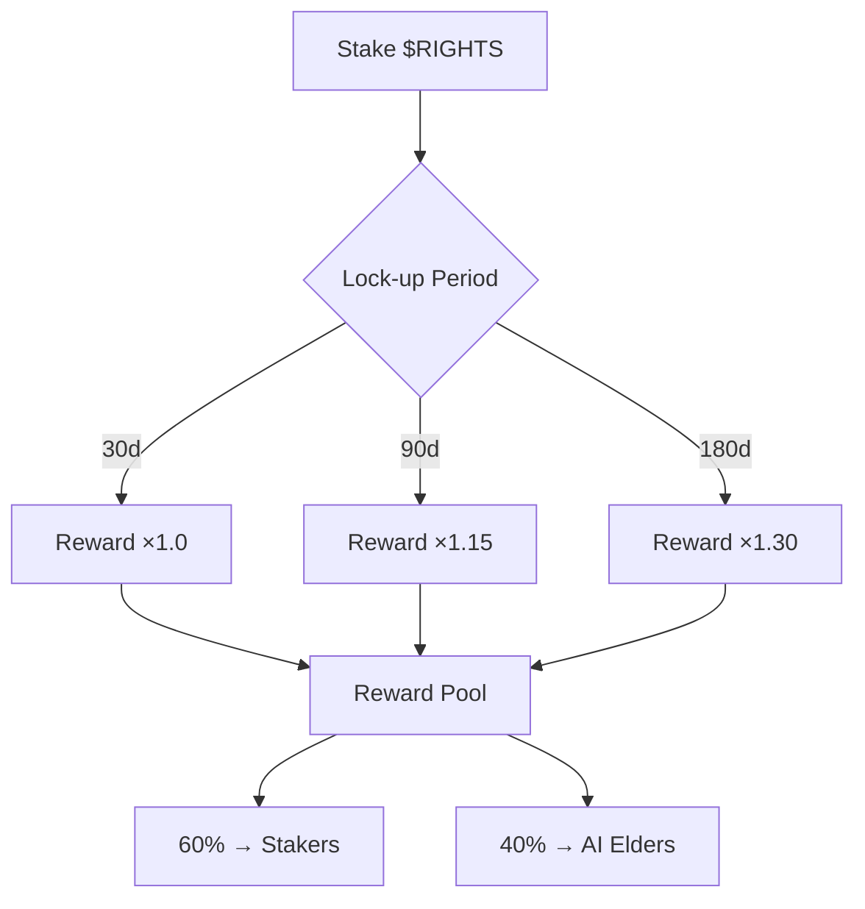
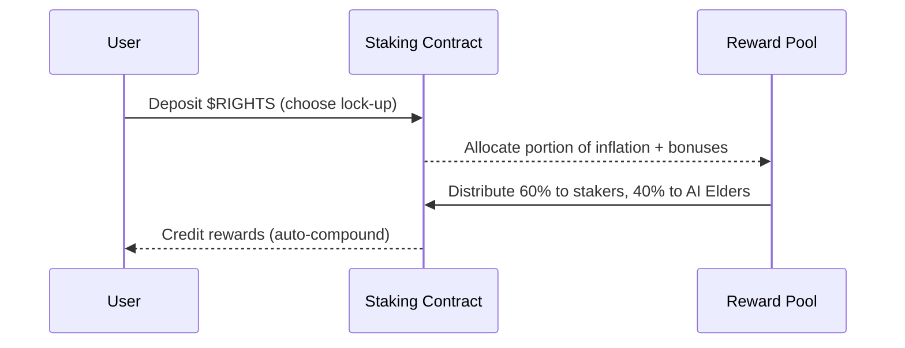

# TOKENS.md  
**Decentralized Rights Protocol (DRP)**  

---  

## 1. Overview  

DRP employs a **dual‑token model** to separate governance from day‑to‑day utility while aligning incentives for security, sustainability, and community growth.  

| Token | Symbol | Primary Role | Total Supply |
|-------|--------|--------------|--------------|
| Governance | **$RIGHTS** | Protocol governance, staking, consensus, voting | 1,000,000,000 |
| Utility | **$DeRi** | Transaction fees, service payments, reward distribution, burn‑driven deflation | 10,000,000,000 |

The two tokens interact through **staking‑reward flows**, **fee‑burn mechanisms**, and **governance‑driven parameter updates**, creating a self‑reinforcing economic loop that rewards honest participation and penalises malicious behaviour.

---  

## 2. $RIGHTS Token (Governance)  

### 2.1 Core Parameters  

| Parameter | Value |
|-----------|-------|
| **Total Supply** | 1,000,000,000 $RIGHTS (fixed cap) |
| **Purpose** | Governance, staking, consensus participation |
| **Inflation Rate** | 2 % per annum (minted to reward stakers) |
| **Base Staking APR** | 8 % per annum (distributed from inflation) |
| **Bonus Rewards** | • 2 % for consensus participation  <br>• 3 % for AI Elder nodes  <br>• 2 % for sustainability‑linked actions |

### 2.2 Distribution  

| Allocation | % of Supply | Tokens | Description |
|------------|-------------|--------|-------------|
| Community | 30 % | 300,000,000 | Airdrops, community incentives, liquidity mining |
| Development | 20 % | 200,000,000 | Core dev team, future upgrades |
| AI Elders | 15 % | 150,000,000 | Nodes that run AI‑driven consensus & validation |
| Sustainability | 10 % | 100,000,000 | Clean‑energy projects, carbon‑offset programs |
| Public Sale | 15 % | 150,000,000 | Token‑sale participants (price‑discovery) |
| Team | 10 % | 100,000,000 | Founders & early contributors (vested) |

### 2.3 Staking Mechanics  

* **Minimum stake:** 10 $RIGHTS (adjustable via governance).  
* **Lock‑up periods:** 30 days, 90 days, 180 days – longer periods earn higher multipliers (1.0×, 1.15×, 1.30×).  
* **Reward pool:** Inflation‑derived + bonus allocations (see §2.1).  
* **Reward split:** 60 % to stakers, 40 % to AI Elders (see Economic Mechanisms).  

---  

## 3. $DeRi Token (Utility)  

### 3.1 Core Parameters  

| Parameter | Value |
|-----------|-------|
| **Total Supply** | 10,000,000,000 $DeRi (fixed cap) |
| **Purpose** | Transaction fees, service payments, reward distribution |
| **Deflationary Mechanism** | 0.1 % fee on every transfer is **burned** (reducing circulating supply) |
| **Transaction Fee** | 0.1 % (0.05 % to protocol treasury, 0.05 % burned) |

### 3.2 Utility Functions  

* **Payment for API calls** (e.g., rights‑verification services).  
* **Fee‑payment for cross‑chain bridges** and off‑chain data feeds.  
* **Reward distribution** for content creators, data providers, and sustainability participants (via $RIGHTS‑linked bonus programs).  

---  

## 4. Economic Mechanisms  

### 4.1 Staking System Details  



* **Reward Calculation:**  
  `Reward = (Base APR + Bonus %) × Lock‑up multiplier × Staked amount`.  

* **Compounding:** Rewards are automatically restaked unless the user opts‑out.

### 4.2 Reward Distribution  

| Recipient | Share of Reward Pool |
|-----------|----------------------|
| Stakers (individuals & delegators) | 60 % |
| AI Elder nodes (consensus validators) | 40 % |

### 4.3 Slashing  

* **Penalty:** 50 % of the slashed stake is **burned**; the remaining 50 % is redistributed to honest validators.  
* **Triggers:** Double‑signing, prolonged downtime, or proven malicious data injection.

### 4.4 Anti‑Sybil Mechanisms  

| Mechanism | Description |
|-----------|-------------|
| **Proof‑of‑Stake Weighting** | Minimum stake thresholds prevent mass account creation. |
| **AI‑Elder Reputation Score** | Nodes must maintain a reputation > 0.7 to earn rewards; reputation is decay‑adjusted. |
| **Identity‑Bound Staking** (optional) | Users may bind a verified DID to their stake, adding a social‑cost layer. |
| **Randomized Validator Rotation** | Reduces the advantage of any single entity controlling a large validator set. |

---  

## 5. Token Utilities  

| Token | Primary Use‑Cases |
|-------|-------------------|
| **$RIGHTS** | • Governance voting (parameter changes, upgrades) <br>• Staking for consensus & security <br>• Access to AI‑Elder node delegation <br>• Bonus eligibility (sustainability, consensus) |
| **$DeRi** | • Paying transaction fees on the DRP network <br>• Purchasing data‑verification services <br>• Rewarding contributors (content, data, carbon‑offset projects) <br>• Burning to increase scarcity & token value |

---  

## 6. Governance Model  

1. **Proposal Submission** – Any holder with ≥ 10,000 $RIGHTS may submit a proposal.  
2. **Discussion Period** – 7‑day forum/discussion window.  
3. **Voting** – Token‑weighted voting; each $RIGHTS equals one vote.  
4. **Quorum** – Minimum 5 % of total $RIGHTS supply must participate.  
5. **Pass Threshold** – Simple majority (≥ 50 % of votes cast) **and** ≥ 20 % of total supply voting “Yes”.  
6. **Execution** – Approved proposals are executed automatically via smart‑contract calls.  

*Governance can adjust: inflation rate, staking APR, fee percentages, and sustainability reward ratios.*  

---  

## 7. Value Accrual  

```
[Transaction Fees (DeRi)] --> Burn (0.05%) --> Reduces DeRi Supply --> Increases DeRi scarcity
[Staking Rewards (Rights)] <-- Inflation (2%) --> Minted Rights --> Distributed to stakers & AI Elders
[Governance Decisions] --> Optimize fee & reward parameters --> Improves network utility & token demand
[Sustainability Bonuses] --> Rights allocated to green projects --> Positive externalities attract ESG investors
```

* The **burn‑driven deflation** of $DeRi raises its per‑token value, while **inflation‑driven rewards** for $RIGHTS incentivise long‑term holding and active participation.  

---  

## 8. Token Release Schedule  

| Token | Vesting Type | Cliff | Linear Release | End of Vesting |
|-------|--------------|-------|----------------|----------------|
| $RIGHTS – Community | 12‑month cliff, then 24‑month linear | 12 mo | 1/24 per month | 36 mo |
| $RIGHTS – Development | 6‑month cliff, then 30‑month linear | 6 mo | 1/30 per month | 36 mo |
| $RIGHTS – AI Elders | Immediate (no vesting) | – | – | – |
| $RIGHTS – Sustainability | 3‑month cliff, then 21‑month linear | 3 mo | 1/21 per month | 24 mo |
| $RIGHTS – Public Sale | 6‑month cliff, then 18‑month linear | 6 mo | 1/18 per month | 24 mo |
| $RIGHTS – Team | 12‑month cliff, then 36‑month linear | 12 mo | 1/36 per month | 48 mo |
| $DeRi – All allocations | Immediate release for liquidity, 12‑month linear for reserves | 0 mo | 1/12 per month | 12 mo |

*All vesting schedules are enforced on‑chain via timelock contracts.*  

---  

## 9. Sustainability Incentives  

| Incentive | Mechanism | Reward |
|-----------|-----------|--------|
| **Clean‑Energy Node Certification** | Nodes that power their hardware with ≥ 80 % renewable energy receive a **2 % bonus** of $RIGHTS per epoch. |
| **Carbon‑Offset Contributions** | Verified carbon‑offset projects submit proof; DRP mints **0.5 % of total annual $RIGHTS inflation** to the project’s wallet. |
| **Eco‑Staking Pools** | Users who stake $RIGHTS from the “Sustainability” allocation earn an **extra 1 % APR** on top of the base 8 % when they also lock $DeRi for gas fees. |
| **Green‑Data Marketplace** | Data providers that prove low‑energy data pipelines receive $DeRi fee rebates (0.02 % of each transaction). |

These incentives are **governance‑adjustable** and are reviewed quarterly by the AI Elder council to ensure alignment with evolving ESG standards.  

---  

## 10. Diagrams  

### 10.1 Token Flow Diagram  

```mermaid
graph LR
    subgraph Users
        U1[User A] -->|Pays fee (DeRi)| N1[DRP Network]
        U2[User B] -->|Stakes (Rights)| N1
    end
    subgraph Network
        N1 -->|Burn 0.05% DeRi| Burn[Burn Address]
        N1 -->|Distribute 0.05% DeRi| Treasury[Protocol Treasury]
        N1 -->|Mint 2% Rights (inflation)| Mint[Rights Mint]
        Mint -->|60% to Stakers| Stakers
        Mint -->|40% to AI Elders| AI_Elders
    end
    subgraph Governance
        Gov[Governance (Rights holders)] -->|Votes| Params[Protocol Parameters]
        Params -->|Adjust| Fees[DeRi Fee %] & Inflation[Rights Inflation %]
    end
```

### 10.2 Staking & Reward Cycle  



---  

**End of TOKENS.md**  

*All numbers are illustrative and subject to change through on‑chain governance.*  